# 0 什么是API

API 的定义和作用：API是应用程序接口，是为了方便客户和开发人员使用，以实现某种功能。

JAVA API就是提供给JAVA工程师的一种方法库，API文档中拥有JAVA的大部分知识，熟悉JAVA API就会更一步的熟悉JAVA

# 1 常用的API（基础笔记可看可不看类型）

这些API就是一些JDK里面给我们的类，这些类已经封装完成，在使用的过程中是不需要我们去了解它的原理，只需要了解它的功能就可以，同时我们书写API也是这样，我们将API写好，最后由别的工程师去利用。但是阅读这些常用的API有助于我们了解有那些类型的API。

## 1.1 Scanner（普通类）

这个API就是一个非常普通的类，里面供给了许多与扫描相关的方法，通过这些方法我们大概可以猜测，API里的方法要如何命名，对于不用数据类型的返回值方法要如何写，对于变量不同的方法，我们又要如何写。

1. 命名：名字要和方法的操作有相关性
2. 名字上要体现是什么返回类型的
3. 通过方法的重载来实现

## 1.2 Number（包装类）

这个类是使用面向对象的思想重新定义了数据类型，将全部的数字数据类型变成一个对象，并且全部继承Number类中，对这些数据类型进行维护，并且为这些数据类型提供相应的方法。

这些对象式的数据类型和原始数据类型最大的区别就是有无方法的支持

这个也和我们之前定义的`Pet`的抽象类相同，这个类主要就是拿来对所有存在的宠物进行一个统一的管理

## 1.3 Math（工具类）

工具类就是在使用的时候没有必要在`new`这样一个对象，你只要`Math.方法`就可以使用这个方法，就是一个螺丝刀拧螺丝，没有必要每一次拧螺丝的时候都买一把新刀。

这种类的制作方法就是将类里面的方法全部定义成`static` 方法，只要将类定义成这样的类，那就无法再被`new`直接使用就可以

## 1.4 Random和ThreaLocalRandom（父子类）

Random是随机数类，在生成随机数的过程中使用的是时间戳来控制：时间戳的加减法。

ThreaLocalRandom是Random的子类，相对于Random的功能更全面，也更高效，同时线程安全，在使用的过程中也与时间戳有关

Random是原始类，而这个子类的功能和她相似，但是在线程方面更加出色

## 1.5 Data和它的衍生类

Data类是一个非常简单、基础、底层的的类，已经过时，但是有很多用法是根据这个基础类来进行衍生，也是一个对于时间非常重要的类。

衍生类：DataFormat抽象类，对时间格式化，使用的过程中需要使用它的子类SimpleDataFormat。而且这个格式化是有根据的，可以自己设置。 

## 1.6 Calendar(日期类)

里面有许多方法是对日期和时间进行控制的，在这个类中有许多的字段，可以直接当作工具类进行使用。

而且有非常多的字段

在我们的社交软件中我们中可以用这个来计算年龄，这个类要用在软件中还是非常有意义的。

是不是在入侵一个程序以后可以来修改一些时间呢:happy:

闹钟的设置好像也是可以使用这个类的。比如背单词的软件提示也可以去使用这个类

## 1.7 System（系统类）

这个类里面的方法都是非常常见和使用的方法，性能也比较高

# 2 企业中脱离main方法的测试

## 2.1 main方法的定位

`main`方法就是进入程序的一扇门，而这个门只负责开和关，至于门上有一把锁，但是这个锁的功能由锁来决定，而不是门。所以在程序中`mian`方法中只要有一句或者极少几句代表这个锁就像，而锁的内部结构我们是不管的。

总结就是`main`方法中的语句不应该有逻辑性的语句，而且代码应该是非常之少的。

在项目中也只有一个`mian`函数，但是一个项目是有多人要完成的，我们不能总是合并全部的工作测试，然后再修改。这个问题如何解决呢？

## 2.2  Junit单元测试

“单元测试”很容易想到小学的英语单词单元听写，单元就是将一个大的块头分小，测试则就是开是否与预期相同。小学一本英语教材有100个单词，分成五个单元去背，然后老师在一定的时间内听写这个单元的单词，查看学生掌握程度，就是单元测试。

在面向对象的过程中也是一样，我们将一个程序划分成一个一个类和一个一个方法，而这些方法是不是能到达我们的预期，这就需要我们对这些方法进行测试。

## 2.3 Junit的Java包的下载

1. 打开魔法软件
2. 在搜索引擎中搜索maven repository 打开这个网页
3. 再在maven repository中搜索Junit
4. 打开`Junit`不是API也不是其他奇奇怪怪的文件，再点击`Files`选项中的jar（下载在桌面上）

## 2.4 如何使用Junit进行单元测试

### 2.4.1 包的导入

1. 先在Dome中new一个Directory，命名为`lib`
2. 将桌面上的jar包直接拖拽到`lib`中
3. 右键单击jar包`add library ...`

### 2.4.2 Junit的使用

1. 我们先创建一个类专门用来对另外一个类做测试

   

2. 在非测试类中编写方法

   ```java
   package com.study.shea;
   
   public class Calc {
      public static int sum (int numberA, int numberB){
          return numberA + numberB;
      }
   }
   ```

   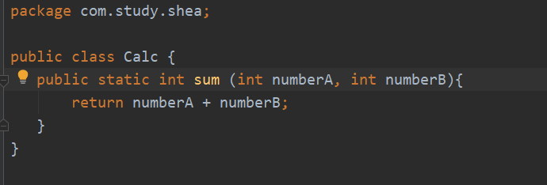

3. 使用注释调用Junit

   ```java
   package com.study.shea;
   
   import org.junit.Test;
   
   public class CalcTest {
   
       @Test//使用这条注释来调用函数
       public void sum(){
          int sum = Calc.sum(1,2);
          System.out.println("sum = " + sum);
       }
   }
   
   ```

   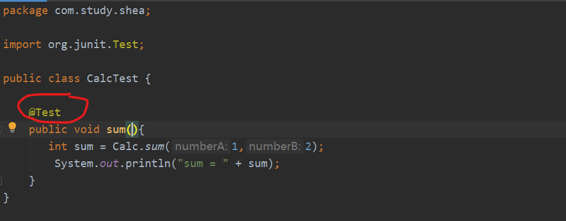

   最后的预期结果会显示在原来的调试框中

> **在编写代码时候犯的错：**
>
> **1. 在编写方法体的时候`return`没有写，写完以后没有对方法的返回值进行修改，方法体上没有写static**
>
> **2. 因为上述原因，在测试函数无法进行**

遗留问题：测试的结果还是人工计算，并不是计算机帮忙完成的

## 2.5 Assert 断言 

在上面的操作中我们已经脱离了`main`方法的测试，但是我们还是没有脱离`print`打印的测试，这个时候我们就要使用到Junit的断言测试方法。

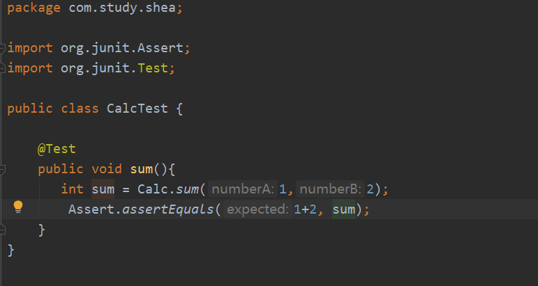

测试结果

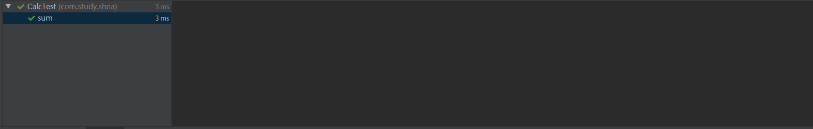

在这个测试过程中我们没有自己进行计算，没有使用`main`方法运行，也没有使用`print`进行打印，最后的结果就是测试的通过。

但是这个测试还是十分有限的，如果只有`1+2`可以通过，那这个函数还是有问题的

## 2.6 更进一步的测试

**随机测试**

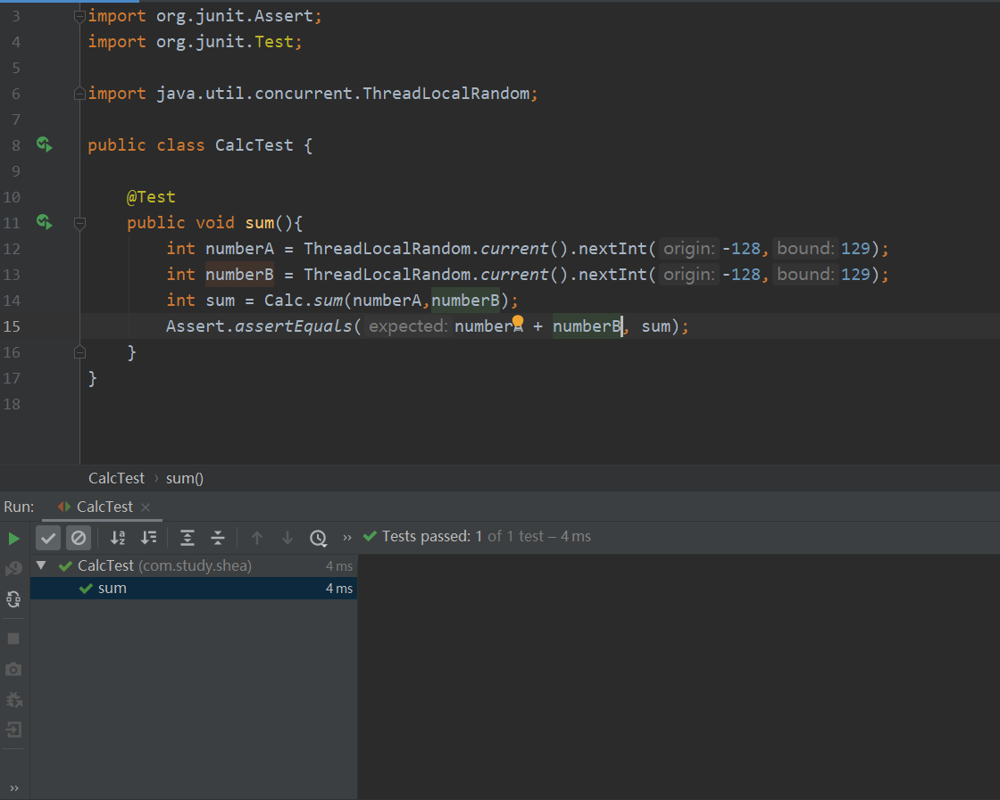

在上面的测试过程中，给的数是随机的，并不能由我们人来决定，这样就可以使得测试会更有说服力

**测试之间互相不干扰**

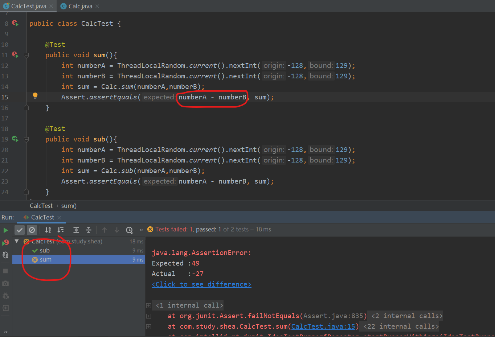

当有一个测试出错时，并不会影响到另外一个函数的测试，这样的结果也是比`main`方法的测试要好许多

# 3 String

## 3.1 认识String 

在java OOP课程中我已经将String类中的全部函数都练习了一遍，这里就不再练习了

除了这个以外java的String还有一个比较特殊的点：那就是String不能被改变！

现在我们假设有两个String`str1`和`str2`，在创建这两个String类的时候我们的计算机会给他们各自一块内存，现在我们执行`str1 = str1 + str2`按照我们的逻辑是`str1`的内存内容被修改，内存还是只占了两块，但是世纪的情况是现在有三块内存`str1(str1+str2)`、`str1`、`str2`

## 3.2 StringBuilder和StringBuffer

> 这个两个类可以解决上述的问题，但是StringBuffer涉及多线程，因此暂时搁置

StringBuilder如何使用：


这个和`String`不一样的地方时是，你创建一个`String`类就是创建了一个对象，创建多个就是创建多个对象，但是`StringBuilder`是对对象进行操作，一直操作的都是一个对象。

# 4 Throwable

## 4.1 Throwable的两个子类错误 Error

1. 1. 不常见
   2. 基本上不能解决
   3. 尽量避免
2. 异常Exception
   1. 常见
   2. 可以定位，通过修改代码解决
   3. 不是编译失败，代码语法没有问题

## 4.2 如何定位异常

定位错误：编写好程序后，运行程序，在输入运行结果栏中会存在异常提示，红色中蓝色链接，就能找到自己的代码错误。

解决错误：先阅读异常提示，如果了解就直接修改，如果不了解那就搜索异常提示，了解问题所在，解决问题

最经典异常展示：

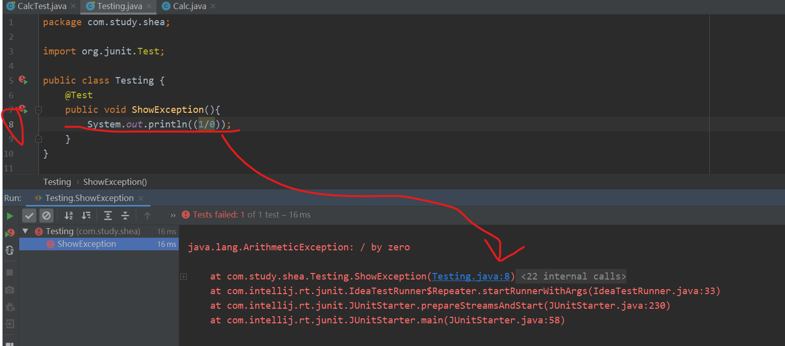

## 4.3 运行时异常RunTimeException

运行时异常是可修改可不修改的，不会对你的项目运行产生影响，但是非运行时异常必须修改因为这样会使得你的项目直接无法运行（但是现在的编译器比较智能，一定会让你`try--catch`）

运行时异常有点像我们玩游戏的时候的一些漏洞，它不会影响我们玩游戏，但是我们有一些漏洞可以捡，比如更新以后某个英雄的某个技能，在某个时间可以无限的放或者平A就能秒死人。

但是非运行时一场那就是这个游戏你就进不去

> 与非运行时异常的区别：
>
> 编译器中，运行时异常不会要求你捕获，但是非运行时异常会强制要求你捕获
>
> 所以我们在编写自定义异常的时候不会定成运行时异常

## 4.4 try catch 试图捕获异常

**try catch的作用**

定位异常，而且是定位一个代码块的异常，运行完成这个代码块后，抛出这个代码块的异常。

try catch可以搭配finally使用，也是可以不搭配，finally的意思是在捕获完成以后使用，但是要使用finally就必须搭配try catch。

try catch的捕获内容是可以自定义的，你可以让他抛出异常，也可以不让他抛出异常，所以根据这个小漏洞，你可以去骗毕业设计（下面就展示如何不抛出异常！）但是企业中千万不要作死

> **正常捕获：**
>
> 运行可以通过、但是会显示一场的结果和定位异常


> **欺骗老师：**
>
> 运行还是通过、但是不会定位异常

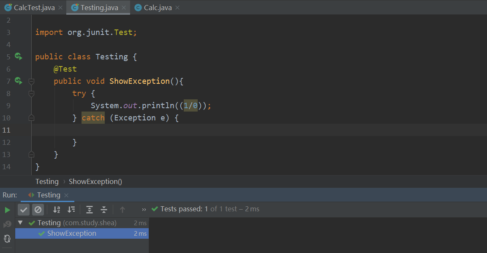

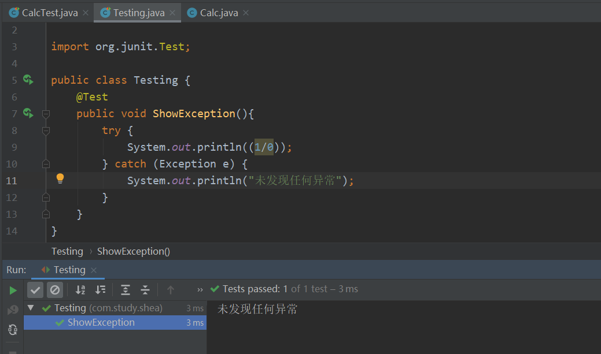

> **警告！**工作中绝对不能用

## 4.5 NullPointerException空指针异常

空指针异常的情况

- Calling the instance method of a `null` object.
- 调用空对象的实例方法。
- Accessing or modifying the field of a `null` object.
- 访问或修改空对象的字段。
- Taking the length of `null` as if it were an array.
- 将 null 的长度当作一个数组。
- Accessing or modifying the slots of `null` as if it were an array.
- 访问或修改 null 的插槽，就好像它是一个数组一样。
- Throwing `null` as if it were a `Throwable` value.
- 将 null 视为 Throwable 值。

在有关对象判断类中会有抛出空指针异常的情况

## 4.6 throw 抛出异常

**throw**的作用就是抛出异常，有什么用呢？

通过捕获异常的功能，我们可以写判断或抛出异常的方法，在不通过的情况下提醒程序员，这样程序员可以快速的更改代码，以防止程序在后面出现更严重的问题

> throw和try--catch的区别：
>
> throw是用来抛出异常的，而try--catch是尝试运行并捕获
>
> 两者结合可以达到十分好的效果

## 4.7 自定义异常

有一点太高级了，以后学完更多再来看一遍

# 5 File 文件

## 5.1 :star:文件路径

文件路径要了解和区别绝对路径和相对路径，而且在win系统中的文件路径和linux/nuix系统中的路径是不一样的

1. 绝对路径：

   win中是从盘符开始，使用`\`一层一层向下：`D:\DevTools\Git\bin`

   linux中是从根目录`/`，使用`/`一层一层向下：`/home/shea/Documents/pdf`

2. 相对路径：

   前提：已经已知一个绝对路径

   然后另外一个路径与这个文件夹的关系

3. 在代码中的win系统如何表示

   `D:\\DevTools\\Git\\bin`

   为什么要有两个斜杠？在编译语言中`\`是转译符号要让编译器识别`\`必须要写两个斜杠

## 5.2 File类的使用

1. 在我们使用这个类`new`一个对象的时候一定要使用绝对路径
2. 然后可以去练习一下他所含有的方法

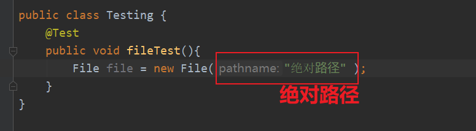

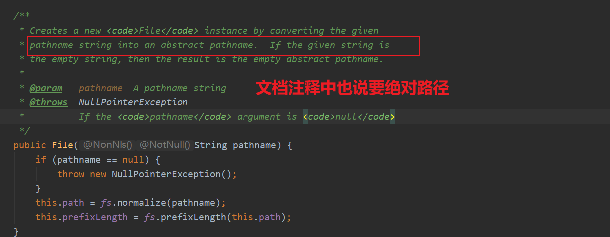

这个类中不但包含了对文件的操作，还有很多方法是对文件夹的操作

文件流中最重要的是对文件路径的了解，这样就很好的调用文件流中的类

# 6 I/O流

## 6.1 理解字面意思I/O Stream

### 6.1.1 英文  Input/Output Stream

词典中Stream的意思：有方向性的流动的液体/电流

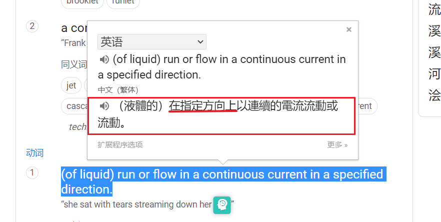

那我们理解I/O Stream是否可以看作是**输入/输出方向的流体**

### 6.1.2 中文 流


我觉得这个解释是比较时候来解释**I/O流**这个名词的：**像水流的东西输入/输出**

> **总结：**不管是中文还是英文的解释（仅代表个人）都表明了两件事
>
> 1. 有一个物体会流动，像水一样
> 2. 有输入和输出两种方式或者两种方向

### 6.1.3 从相对论的角度看待 I/O流

冬天旱季的时候，长江的支流把水**输出**到长江中，长江**输入**这些水

夏季雨季的时候，长江的支流转换角色**输入**这些水，而长江**输出**这些水

当然这个比喻可能打的不是很好，但是我们可以看到作为**输入方还是输出方并不是绝对的，而是相对的**。

> **总结：**
>
> 1. 流动一定会有输出口和输入口
> 2. 而且谁输出谁输入要看你选定的参照系

## 6.2 I/O Stream 文档中的两幅图


**Reading information into a program.**这是官方文档对这张图的解释，对于程序来说是`input`对于数据源来说是`output`，所以说是程序在读取数据源中的数据。


**Writing information from a program**而与上面相反，这次的程序数据流到了数据源中，所以程序在`output`而数据源在`input`，这个时候程序在往程序中灌输数据，所以说是程序在写数据源中的数据。

> **上面两种方式都是站在程序的角度上对数据源的操作，所以我们的参照物是程序，因为我们操纵的就是程序**

## 6.3 I/O 流中的终极父类

中上面两节的解释中，我们能了解到 **I/O流**就是用来管理各种数据的输入和输出，所以在这个包中有两个终极静态父类：`inputStream`和`outputStream`，这两个类提供和数据操作相关的方法，后有其他不同类型的数据控制子类来继承这两个类。

`inputStream`：专门管理数据的读相关操作

`outputStream`：专门管理数据的写相关操作

## 6.4 FileInputStream

### 6.4.1 代码体验

> 在看frank的课前对这个类的体验

**体验：** [CSDN博客](https://blog.csdn.net/ai_bao_zi/article/details/81097898)

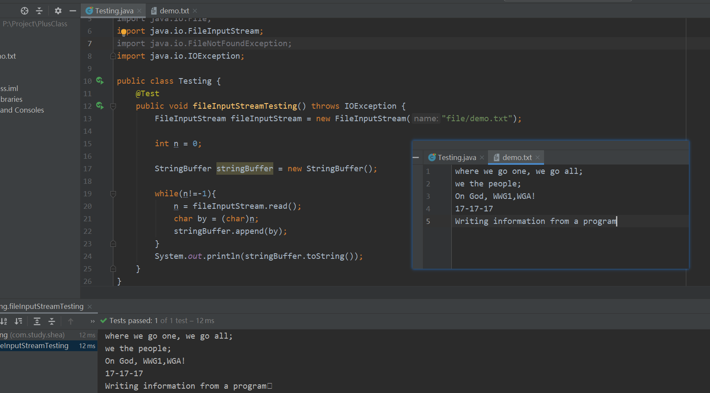

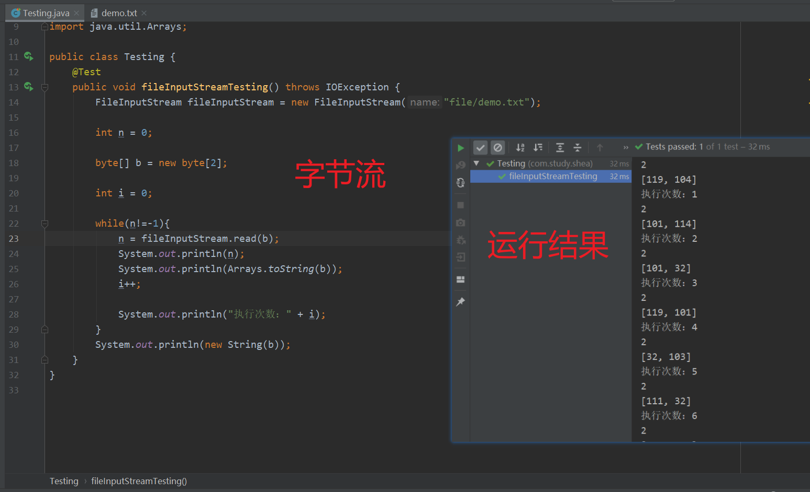

更直观的例子

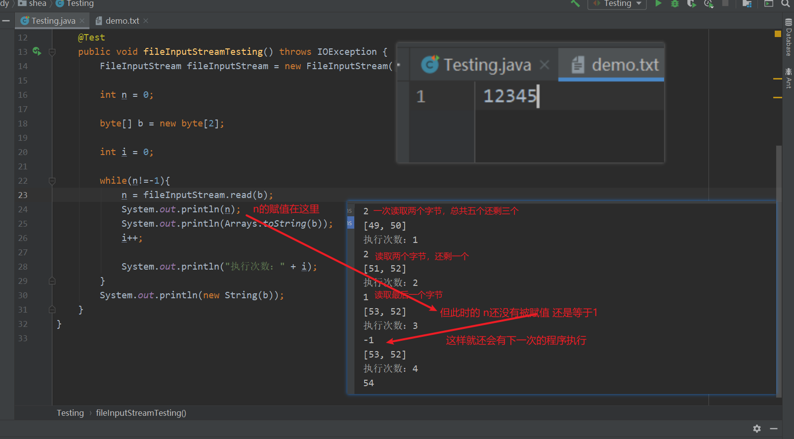

暂时不知道用处

查看源码

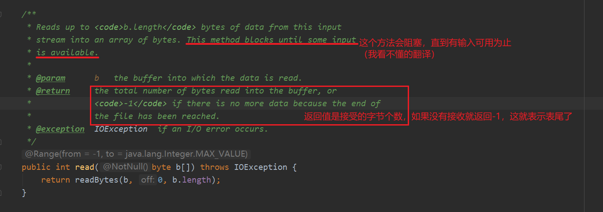

### 6.4.2 观看frank视频

上面有两个读取方式，一个读出的是文字，另外一个读出的全部是字节,在看源码的时候和源码的注释都说明了这个类是按照字节读的，下面这段代码会比较直观

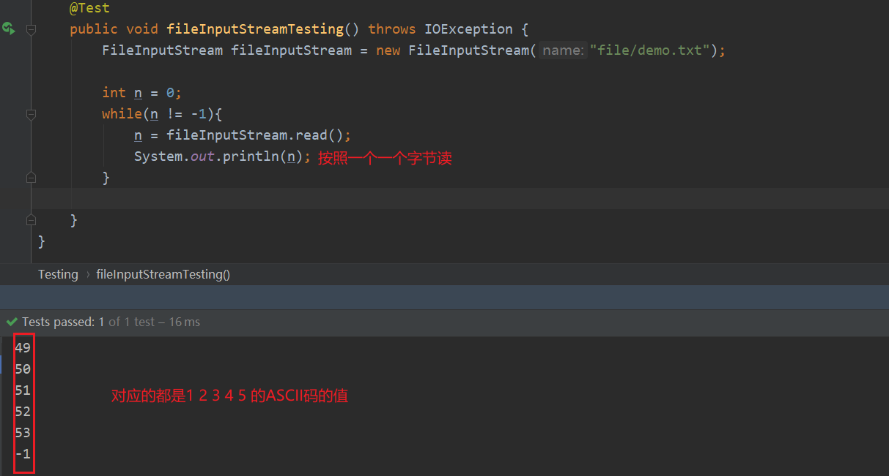

如果我们不想看到ASCII码就需要将它装换成`char`类型，就像体验中的第一种方式那样

> **注意：在代码的末尾都要加上`xxx。close();`不然运行结果出来以后，程序不会关闭**

## 6.5 FileOutputStream

我自己尝试的文件输出流（当给写方法的时候不需要使用for循环）

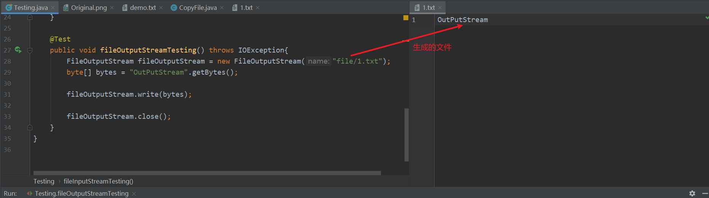

直接使用写函数，读取整个字节数组

## 6.6 文件复制

### 6.6.1 没有听缓冲的时候

> **综合思考：**
>
> **1.综合`FileInputStream`和`FileOutputStream`的特性我们可以看出：文件流的读取是一个一个字节读的，写也是一个一个字节写。**
>
> **2.要复制一个文件先要读取这个文件的内容，再将这些内容写入一个新的文件中。**
>
> **那我们是否可以将文件读文件的字节传输到写文件的字节流里面**

这是我写的代码：

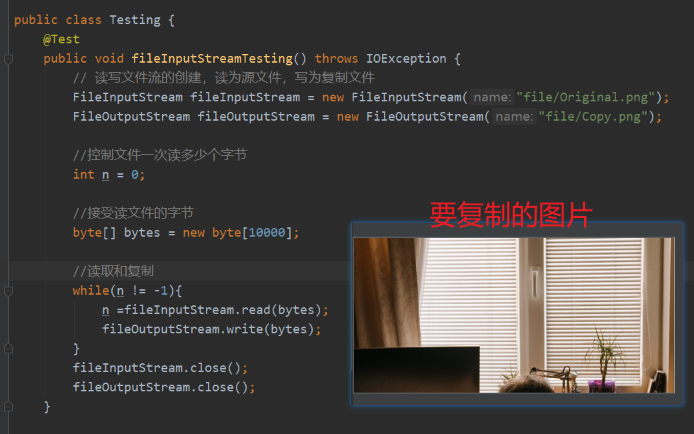

下面是代码的运行结果


> **更进一步：（只是思考，可能是错的）**
>
> **1.封装成工具类**
>
> **2.自动识别文件类型，自动命名文件**

实现了思考`1.`（而且还是要用户手动填充的）

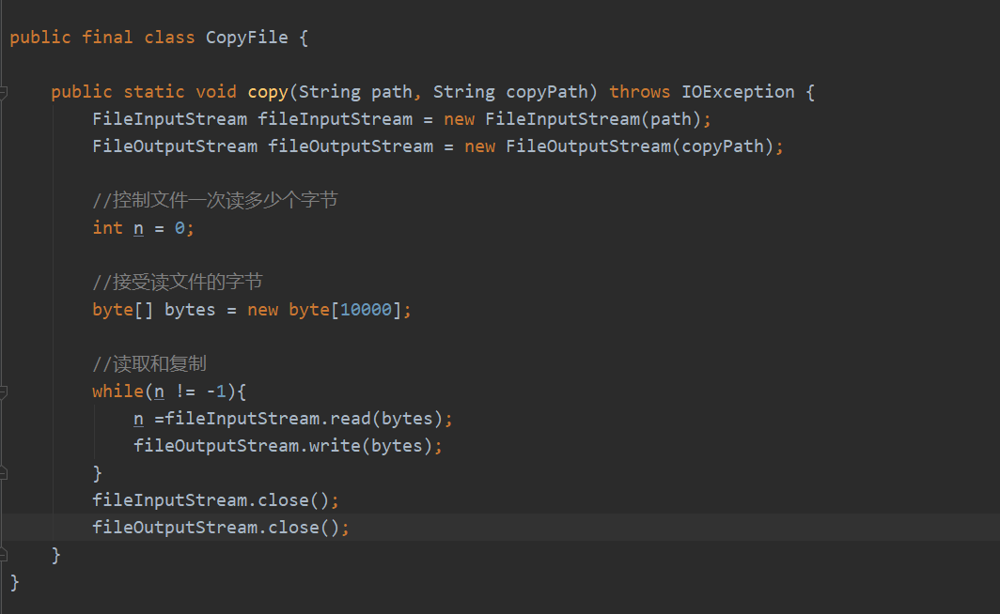

> 虽然看起来好像什么都没有写的样子
>
> 一开始写的不是工具类，有变量，还有构造函数，但是我想把它变成工具类，最后还是这样写了，我觉得这个不应该是复制类，更需要封装到和文件有关的类里面。

### 6.6.2 听完以后

感动天感动地，我的代码和Frank的代码逻辑是一样的

## 6.7 java自带的缓冲（装饰设计模式）

复制文件的代码是自己写了缓冲区，什么是缓冲区呢？在原来的读写文件中是，按字节读也是按字节写的，速度很慢，但是在上面我们加了一个缓冲以后，它是一次性读`1000`个字节，这样就会更快。

而jdk的源码中也是有缓冲输出输入流这样的概念的：这是缓冲输入流，这里的一次性读取8192个字节流

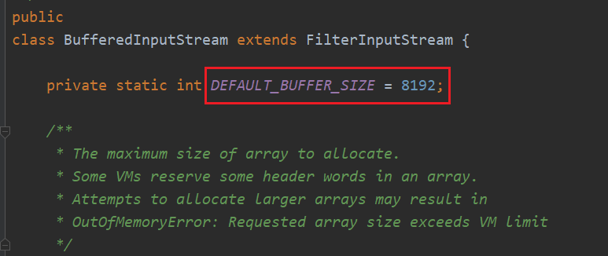

使用这个方法写出来的复制文件函数：在这里面我们不能直接将我们的`path`路径传入到`BufferedInputStream`而是使用了文件输入输出流创建的对象。因为`BufferedInputStream`中接收的是对象而不是字符串，这就涉及到了一个设计模式叫==装饰设计模式==

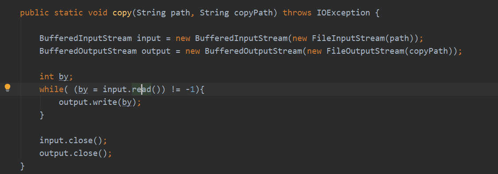

## 6.8 Reader和Writer字符流

上述的流都是使用字节来读，但是这个是读字符，这种流非常适合用来读取文本文件一类的文件。

其实这个流也是以上面的流文件作为基础，将字节读取封装成字符读取。

下面先看看

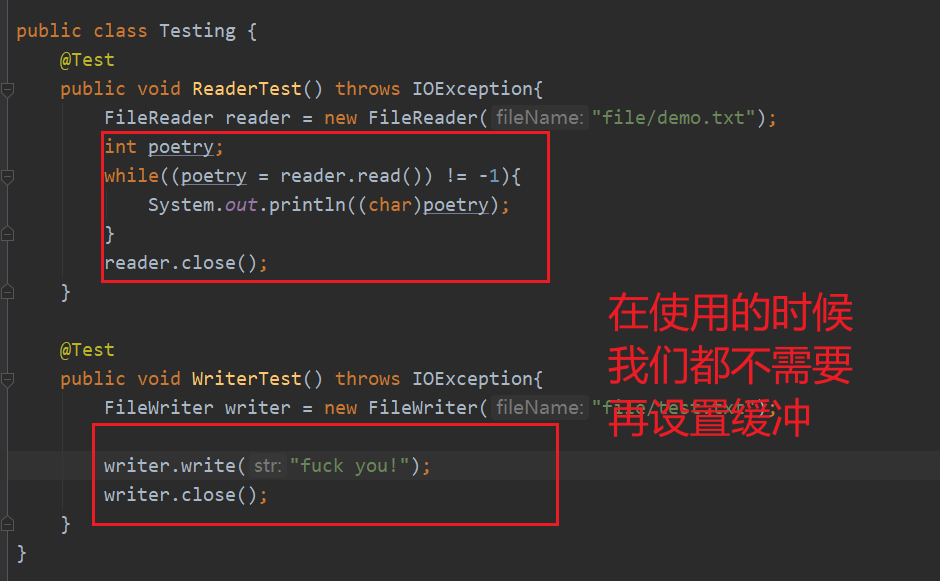

代码和原来的比起来是更加简洁了一些，不需要再设置字节数组来进行读，在写文件的时候也不需要获取字符串的字节流

## 6.9 Buffe VIP 更进一步 更好使用

可以直接读一行，而且输出的时候也是一行输出，这样的使用感受就会更好的了

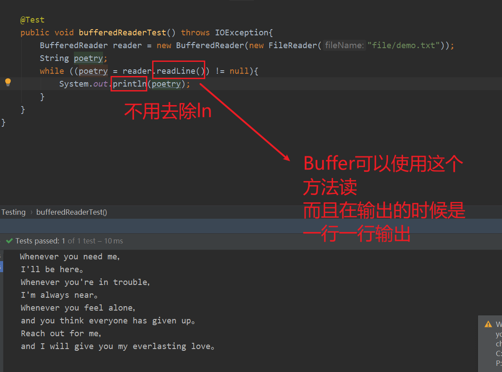

使用写也会非常的简单

> **注意：**不管什么时候都要记得把流关闭，特别是写文件的时候，如果写文件没有关闭，写出来的文件中不会有内容显示

## 6.10 各种流的体验


## 6.11 Apache Commons IO

小超纲，可自己去先了解一些


# 7.Multithreading多线程

> **为什么一台电脑可以做很多事情？**

第一先理解现在的电脑，现在的电脑是一台电脑可以做很多个事情，一边聊天，一边听歌，一边上网查资料。

而可以做到这样的原因是电脑有多个核心（脑子），一个核心可以做一个事情的话，那很多个核心就可以做很多个事情。

而多线程就是一台电脑可以同时运行两个程序

## 7.1 核心数、进程、线程

一个核心下有多个进程，而一个进程下又会有多个线程。

进程与进程之间不会相互影响，因为它们是占有独立内存的；而线程是占用共同的内存，所以一个线程出问题，那这个进程下的线程都会出问题。

线程的工作效率要高很多

并发：是一个CPU需要进行多个进程，这样就需要不停的切换，让进程不断的交替执行

并行：是多个CPU同时执行多个进程

网络搜索：进程和线程的区别

## 7.2 感受多线程程序

先展示一下运行结果

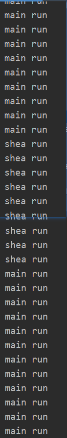

结果就是`main run`和`shea run`两个字符串交替执行，而这实现这个程序的代码如下

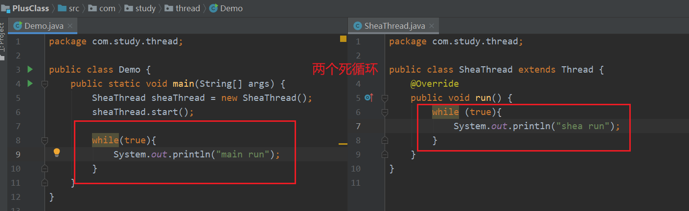

我们可以看到有两个死循环，而显示的结果是两个死循环的内容在交替执行，其原因就是多线程，使用`start()`这个方法的时候就会多创建一个线程

<font color="orange" size="5">**如何创建多线程？**</font>

1. 自己写一个多线程：就如上图所示，让一个类去继承`Thread`
2. 就是写一个接口

## 7.3 多线程的执行过程

以前的程序都是从`main`出发，直线向下进行，而且只有一条主线，而多线程在`main`遇到线程程序的时候会转到线程程序并立马返回到`main`程序中这样`main`程序和线程程序同时执行，这就是多线程的执行方式。

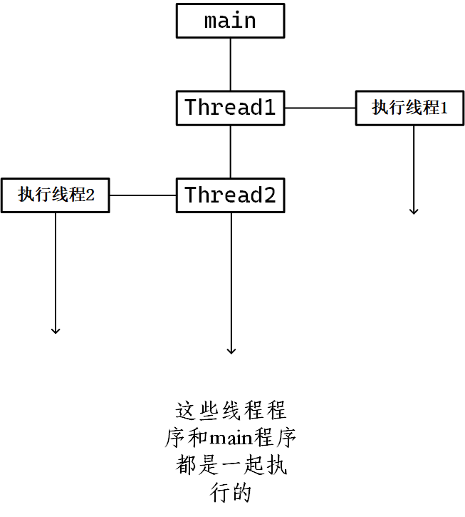

所以在这里，我们把`main`称为主线程。

## 7.4 另外一种创建方式

在前面我们创建线程使用了自己写一个线程的方式去写线程，如果这个线程要继承别的类，就无法使用这种方法，因为java不支持多继承

使用接口来创建线程，及其使用方法的代码

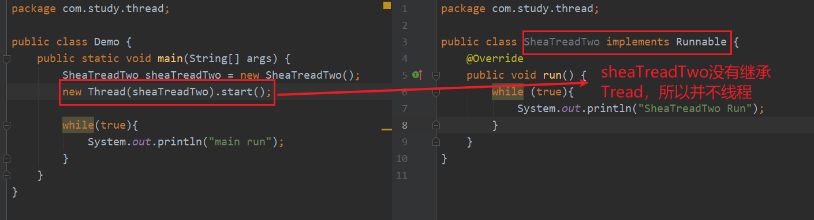

这里这个类实现了`Runable`接口，这样这个类并不是接口类

看运行的结果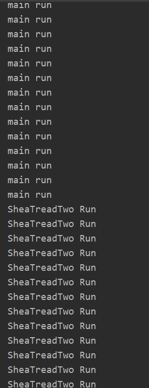

整体来说和使用自己写的线程实现的差不多。

接下来的笔记就是`Ctrl + ` 来查看源码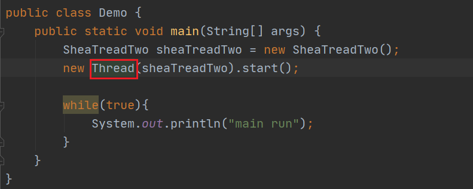

<font color="orage" size="5">**在查看源码的过程中，发现Thread这个类就是实现了Runnable这个接口，而在Thread的构造方法中也有这个有许多方法中传递的函数需要传递Runnable接口类型**</font>

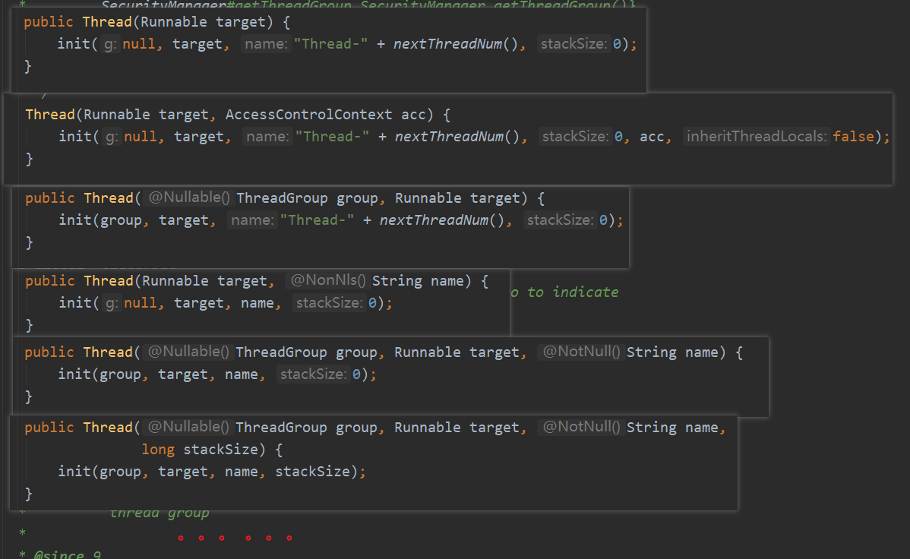

而我们在主函数中实现的应该是第一种传递方式

Thread的构造方法还有很多方式

而且这些构造函数都有一个特点那就是全部是使用`init`这个方法对线程进行实现，现在我们可以来观察一下`init`的实现方法

## 7.5 自我探究一下init

这个是init源码的变量注释

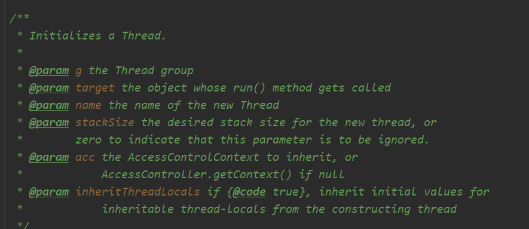

下面的`init`的源码

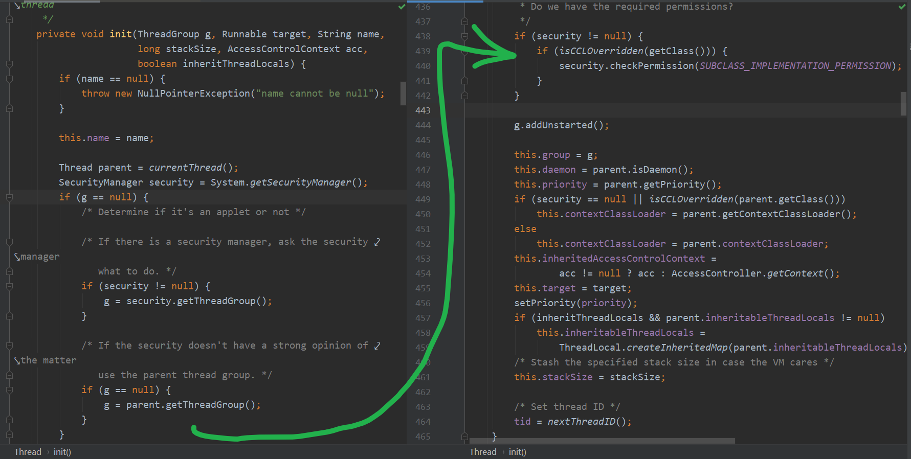

1. 在原始的`init`中名字是不能为空的，如果名字为空会报空指针异常，但是在其他的函数中，如果程序员不给`thread.name`赋值的话也可以自动生成一些值
2. 下面就是线程组相关的安全问题，这个暂时还没有学
3. 接下来就是变量的赋值，这个赋值就和其他函数的初始化相关了
4. 暂时还有很多的内容看不懂

下面的`init`的方法是对上面的函数的衍生

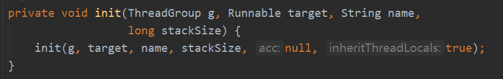

这个`init`方法是构造方法中使用的初始方法。

## 7.6 线程名

在看Thread源码的时候，里面有传线程名的构造方法，那如何在原来线程的类中自动获取你在主线程中设置的名字呢？

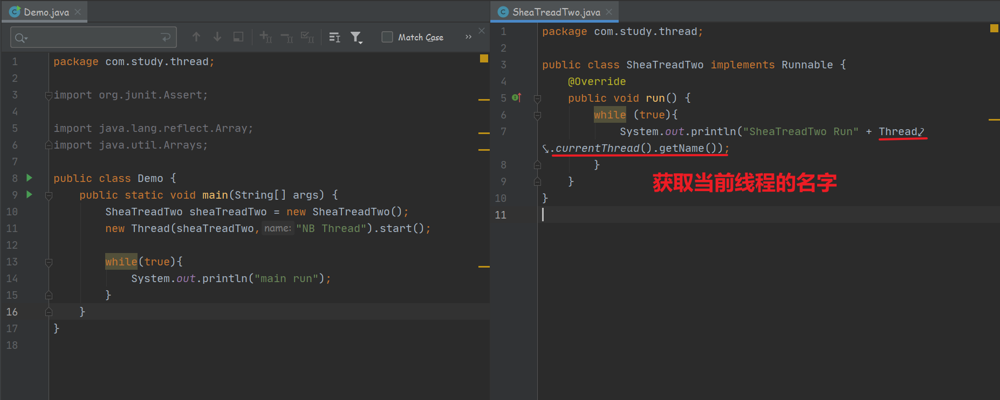

使用`Thread.currentThread().getName()`其中：`getName()`是指获取名字，而`currentThread()`是指当前线程，所以整个翻译成人话就是：获取当前线程的名字

## 7.7 多线程案例--抢鞋

> **稍做总结：**上面的我们弄懂了线程的工作方式，两种创建线程的方式，一种使用继承，一种使用接口实现，而且解决了线程名的问题，那现在的我们就可以开始模拟一下一个多线程的程序——抢鞋

**1. 本线程是使用继承`Thread`的方式创建的**

**2. 抢鞋的逻辑代码涵盖在线程当中：主要就是有10双nike鞋，然后有三个人来抢**

**3. 一个线程就是一个用户，所以这里就有三个名称不一样的线程名**

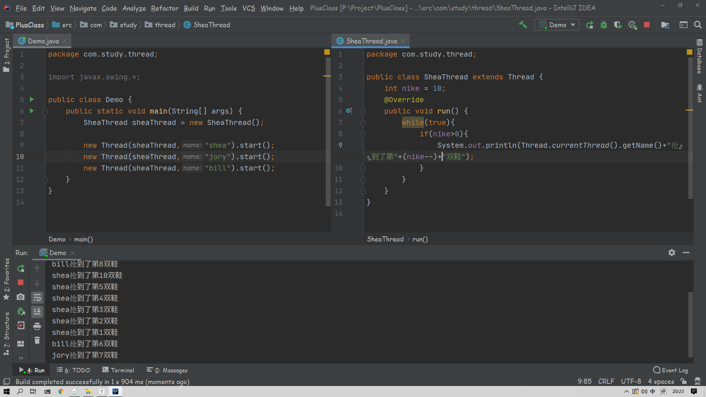

这里可以说是最基本的模拟了一下抢鞋的过程，但是看到执行框框中还是存在一定的问题的，这个问题稍后我们会进行解决。

## 7.8 后台线程--守护线程

这些就是一些后台进程，比如说打开我们电脑的任务管理器


前面有一个应用的话就是前台进程，但是后面的有一个后台进程，这些进程在我们开机的时候就被打开了，这样我们的电脑才能正常而且安全的运作起来，在程序中也是同理的。

有前台线程为用户提供服务，也有后台线程为前台线程提供的服务进行保护或者守护，这样才能正确且安全的进行运作，和计算机的后台进程同理，<font color="red">**后台线程也是在最开始的时候被利用的**</font>

后台线程必定是存在逻辑代码的，但是本课程并没有提，大家可以自己去寻找一些案例，这里只是对后台线程提一嘴。

**后台进程的创建过程：**

**1. 创建一个DaemonThread并实现Runnable**

**2. 重写run方法**

**3. 在运行类中创建先`new`一个DaemonThread，再`new`一个 Thread 用来实现`DaemonThread`**

**4. 最后调用`setDaemon(true)` 最后开启线程**

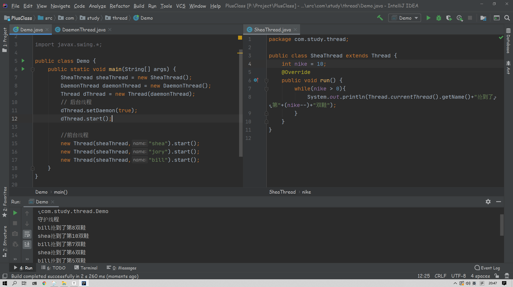

## 7.9 匿名内部类创建线程

> 不是很推荐这种构建方式，所以就提一嘴，但是不过多的解释

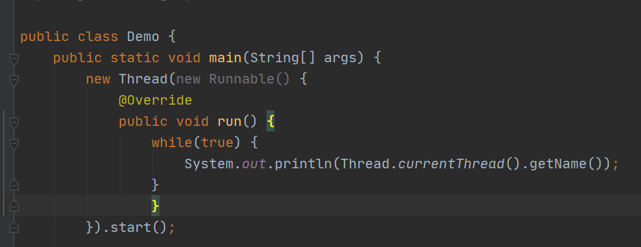

## 7.10 
